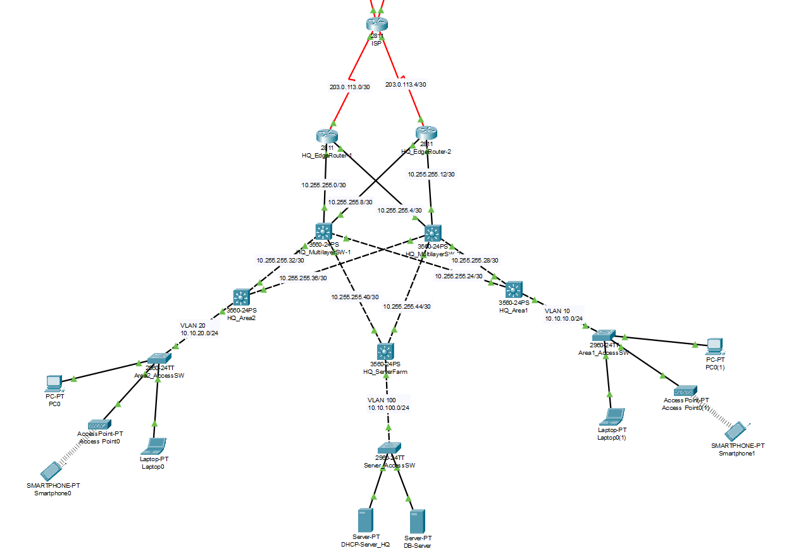
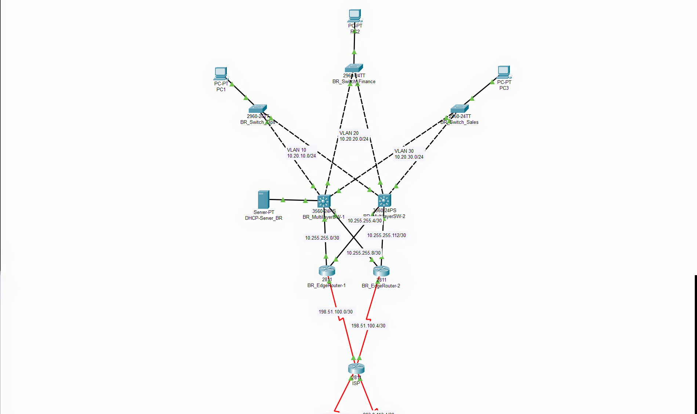

# Mini Network Design: OSPF, NAT & Site-to-Site IPsec VPN

## 📖 Project Overview
This project involves the design and simulation of a large-scale enterprise network infrastructure connecting a Headquarters (HQ) and a Branch Office via a public Internet Service Provider (ISP). It demonstrates the implementation of standard Cisco architectures with a primary focus on **High Availability**, **Scalability**, and **Cross-Site Security**.

The main challenge addressed in this project is ensuring secure isolation between departments, dynamic inter-building communication, and encrypted transmission of confidential data across the public internet.

## 🏗️ Network Architecture
The network design is divided into two main areas, utilizing hierarchical architecture approaches tailored to the scale and requirements of each site:

### 1. Headquarters (HQ) - Three-Tier Architecture
The HQ utilizes a full 3-Tier architecture (Core, Distribution, Access) to handle massive workloads and eliminate Single Points of Failure (SPOF).

* **Core Layer:** Employs two Multilayer Switches (Catalyst 3560) cross-connected to the Edge Routers and Distribution Switches, serving as a high-speed routing processing center.
* **Distribution Layer:** Isolates broadcast domains between departmental areas and acts as the default gateway (Switch Virtual Interface / SVI) for each VLAN.
* **Server Farm:** Isolates centralized services (e.g., DHCP and Database Servers) under VLAN 100 with Static IP management for enhanced security.

### 2. Branch Office - Collapsed Core Architecture
The Branch Office uses a Collapsed Core design (merging the Core and Distribution layers) to optimize hardware capital expenditure (CAPEX) while maintaining full redundancy.

* **Collapsed Core Layer:** A pair of Multilayer Switches (Catalyst 3560) handles internal routing between departments (VLAN 10 Ops, VLAN 20 Finance, VLAN 30 Sales) and provides centralized DHCP services via IP Helper.
* **WAN Edge Layer:** Two branch routers are cross-connected to the core layer and the ISP to translate Private IPs into Public IPs.

## 🛠️ Key Technologies & Protocols
This project implements various industry-standard network protocols:
* **Routing Protocol:** Implemented **OSPFv2 Multi-Area** (Area 0 for the external Backbone, Area 10 for the HQ internal network, and Area 20 for the Branch internal network).
* **Security & Tunneling:** Established a **Site-to-Site IPsec VPN** using ISAKMP (Phase 1) and IPsec (Phase 2) with AES-256 encryption to secure inter-site data.
* **Address Translation:** Configured **NAT Overload (PAT)** equipped with an Access Control List (ACL) for *NAT Exemption*, allowing internet access without disrupting VPN traffic.
* **LAN Switching:** Implemented **VLANs**, **Inter-VLAN Routing (SVI)**, IEEE 802.1Q **Trunking**, and automated loop prevention using **Spanning Tree Protocol (STP)**.
* **IP Services:** Automated IP management using centralized **DHCP Servers** and **DHCP Relay (IP Helper-Address)** configurations across subnets.

## 🚀 Proof of Work (Validation & Testing)
This infrastructure has undergone comprehensive end-to-end testing:
1. **Internet Connectivity:** End-user PCs successfully `ping` the ISP network, verifying NAT Overload functionality.
2. **Dynamic Routing Adjacency:** Routing tables on core devices populate dynamically, evidenced by `O` (OSPF Internal) and `O IA` (OSPF Inter-Area) routes.
3. **Encrypted Site-to-Site Traffic:** Successful private data access between sites (`10.10.x.x` communicating with `10.20.x.x`) across the ISP. The `show crypto ipsec sa` verification proves that data packets are actively encapsulated and encrypted by the VPN tunnel.
