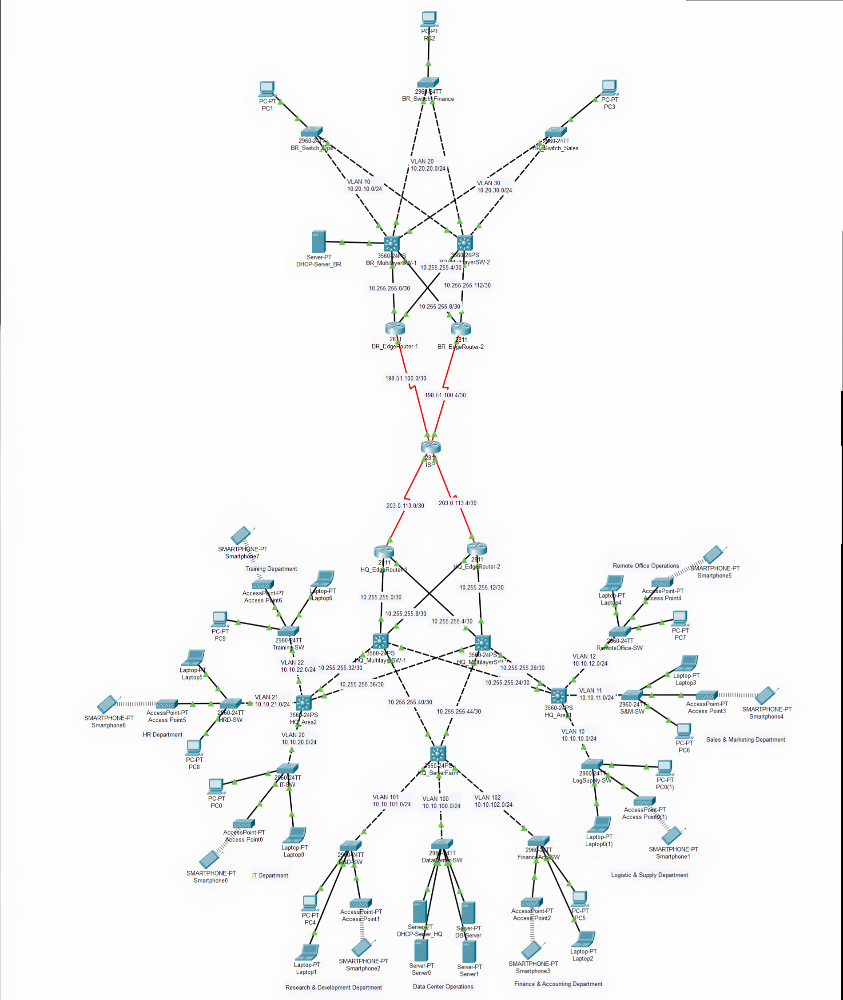
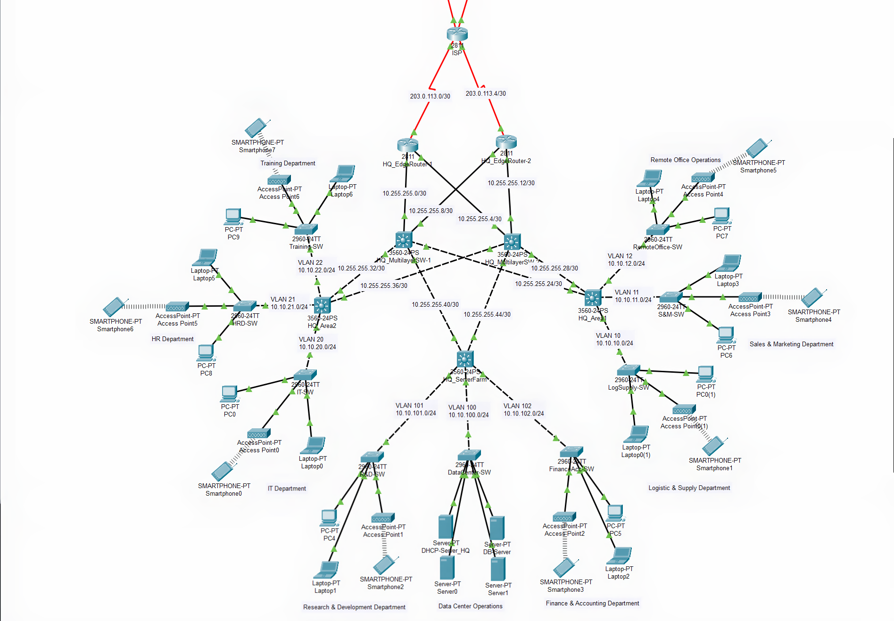

# Enterprise Campus Network Design: High Availability, OSPF, NAT & IPsec VPN

**Author:** Ahmad Gimnastiar

## 📖 Executive Summary
This project demonstrates the end-to-end design and implementation of a highly available, secure, and cost-effective enterprise network. Connecting a Headquarters (HQ) and a Branch office over a public ISP, the architecture strictly adheres to enterprise-grade standards suitable for large-scale operations. The design meticulously balances robust technical performance with financial efficiency, optimizing both CAPEX and OPEX while ensuring strict departmental security segregation.

## 💼 Business Value & Cost Efficiency (CAPEX / OPEX)
* **Optimized CAPEX (Capital Expenditure):** Hardware procurement costs are significantly minimized by strategically deploying advanced Multilayer Switches (Layer 3) exclusively at the Core/Distribution tiers. The Access layer utilizes highly cost-effective Layer 2 switches (Catalyst 2960), and the Branch network adopts a streamlined Collapsed Core architecture.
* **Reduced OPEX (Operational Expenditure):** Network management is deeply centralized. Core services (e.g., DHCP and Database Servers) are isolated within the Data Center, drastically reducing maintenance overhead, simplifying troubleshooting, and streamlining centralized visibility for Network Monitoring Center (NMC) teams.
* **Risk Mitigation:** Strict VLAN segregation across 10 different departments prevents lateral movement of unauthorized traffic, securing sensitive financial and R&D data from other corporate zones.

## 🏗️ Network Architecture

### 1. Headquarters (HQ) - Modular Three-Tier Architecture
The HQ utilizes a full 3-Tier architecture, segmented into three functional zones to handle massive workloads and eliminate Single Points of Failure (SPOF).

* **Core Operations Zone:** Houses critical infrastructure with static IP management. Includes Data Center Operations (Centralized DHCP/DB), Research & Development (R&D), and Finance & Accounting departments.
* **Logistics & Commercial Zone:** Manages external-facing and supply-chain traffic. Includes Logistics & Supply, Sales & Marketing, and Remote Office Operations.
* **Corporate Management Zone:** Handles internal administrative operations. Includes HR, Training, IT, and Development departments.

### 2. Branch Office - Collapsed Core Architecture
The Branch Office uses a Collapsed Core design to optimize hardware costs while maintaining full cross-routing redundancy.

* **Collapsed Core Layer:** A pair of Multilayer Switches (Catalyst 3560) handles internal routing between branch departments (Ops, Finance, Sales) and provides localized DHCP services via IP Helper.
* **WAN Edge Layer:** Dual branch routers are cross-connected to the core layer and the ISP to ensure uninterrupted internet and VPN connectivity.

## 🛠️ Key Technologies & Protocols Implemented
* **Routing:** **OSPFv2 Multi-Area** (Area 0 for Backbone, Area 10 for HQ, Area 20 for Branch) engineered with custom interface costs to resolve asymmetric routing and establish Active/Standby paths.
* **Security & Tunneling:** **Site-to-Site IPsec VPN** using ISAKMP (Phase 1) and IPsec (Phase 2) with AES encryption to secure inter-site confidential data.
* **Address Translation:** **NAT Overload (PAT)** configured with strict Access Control Lists (ACLs) for *NAT Exemption*, allowing internet access without disrupting encrypted VPN tunnels.
* **LAN Switching:** Comprehensive **VLAN** tagging, **Inter-VLAN Routing (SVI)**, IEEE 802.1Q **Trunking**, and automated loop prevention via **Spanning Tree Protocol (STP)**.
* **IP Services:** Automated IP provisioning using centralized **DHCP Servers** and **DHCP Relay (IP Helper-Address)** spanning across 10 distinct subnets.

## 🚀 Proof of Work (Validation & Testing)
This infrastructure has successfully passed comprehensive end-to-end testing:
1. **Dynamic Routing Adjacency:** Routing tables populate dynamically, evidenced by `O` (OSPF Internal) and `O IA` (OSPF Inter-Area) routes across all multilayer switches.
2. **Encrypted Site-to-Site Traffic:** Successful ICMP requests between private sites (`10.10.x.x` to `10.20.x.x`) across the public ISP. The `show crypto ipsec sa` validation proves that data packets are actively encapsulated and encrypted by the VPN tunnel.
3. **Failover Resilience:** Continuous ping tests confirm zero network downtime during simulated primary link failures, validating the High Availability cross-connect design.
